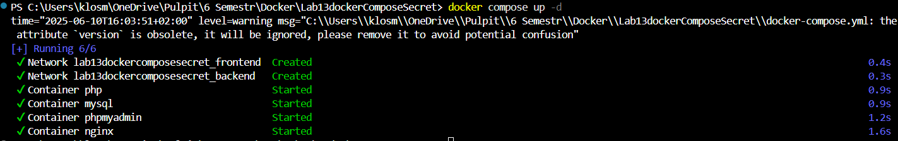
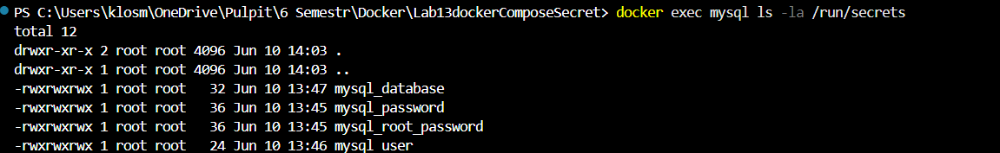
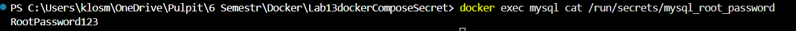
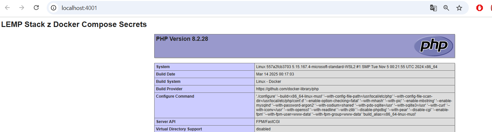
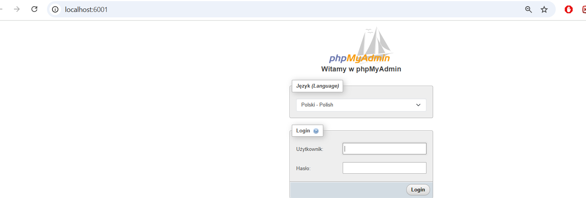

# Labolatrium 13
Stworzenie secretes dla stacka LEMP z labolatorium 12 

### Polecenie 1
uruchomienie pliku compose:
Sprawdzenie statusu kontenerów -> docker compose ps 
docker compose up -d

### Polecenie 2
Sprawdzenie montowania sekretów:
docker exec mysql ls -la /run/secrets/

### Polecenie 3
Sprawdzenie zawartości sekretów w kontenerze:
docker exec mysql cat /run/secrets/mysql_root_password

### Polecenie 4
Sprawdzenie działa strony:

### Polecenie 
Zatrzymanie lempa:
docker compose down 